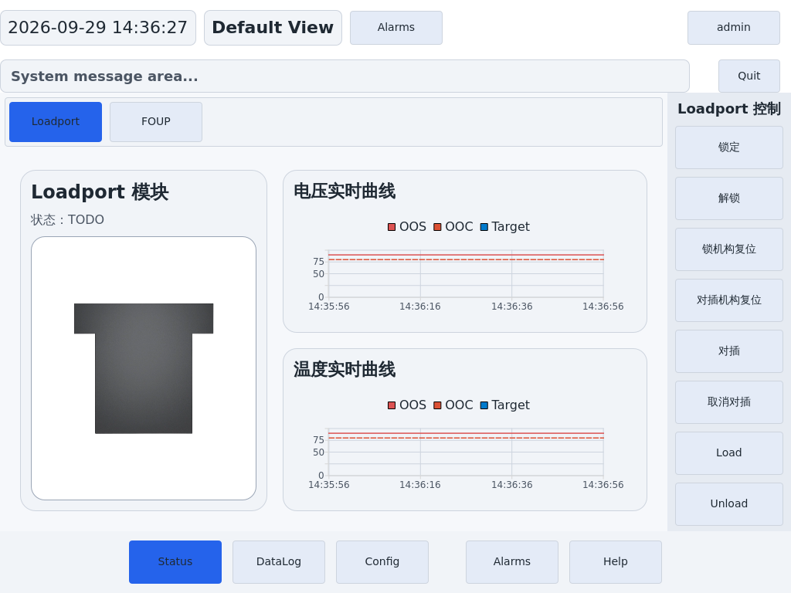

# VOC_Project 全面代码审查报告

- 审查日期：2026-09-29
- 审查基线：`c84e0d2`（审查开始时工作树干净）
- 技术栈：Python 3.11、PySide6 / QML、TCP、串口、E84 / GPIO、独立升级器
- 本次交付：审查报告与验证证据；未修改业务代码、依赖或部署配置。
- 状态标注（2026-09-29 追加）：每项“建议”下方新增一行 `- 状态：`，标明是否已完成及提交号；汇总与未完成原因见 [修复状态](2026-09-29-fix-status.md)。原报告正文未作其他改动。

## 1. 审查结论

项目的基础语法和现有自动化测试通过，但异常路径、设备联锁、界面状态一致性和升级恢复仍有明确缺陷。**不建议仅凭当前测试通过就认定可以可靠部署到现场。** 应先修复 P1 问题，再开展真实设备与升级故障演练。

本报告记录 **34 项问题：P1 15 项、P2 17 项、P3 2 项**。另将认证能力边界、未完成功能和实机待确认项单独列出，未混入问题统计。

| 等级 | 含义 | 数量 |
| --- | --- | ---: |
| P1 | 可能影响设备联锁、已有数据、权限控制、关键故障恢复或升级可用性，建议现场发布前解决 | 15 |
| P2 | 特定操作、异常输入或配置下功能失效、显示错误、资源累积，建议随后修复 | 17 |
| P3 | 已确认存在，但当前界面没有调用或功能入口已隐藏，修复优先级较低 | 2 |

等级表示修复优先级，不表示现场事故已经发生。硬件问题通过 GPIO / 串口替身验证软件行为；实际电气后果仍需设备验证。安全边界问题的触发条件包括异常或被篡改的服务端报文、升级包，影响受进程文件权限限制。

## 2. 范围、方法与验证结果

### 2.1 覆盖范围

| 范围 | 检查内容 |
| --- | --- |
| GUI 启动与装配 | `app.py`、登录状态、信号接线、线程边界、退出流程、配置与路径 |
| 界面 | 全部 45 个 QML 文件；导航、命令面板、登录/配置弹窗、图表、文件与报警页面、待机媒体 |
| 数据与通信 | FOUP 采集、协议帧、版本识别、启停、日志下载、CSV 模型、通道配置、频谱 |
| 设备控制 | E84 状态机、GPIO 输入输出、串口收发与重连、执行机构和 GUI 桥接 |
| 升级与部署 | 包解析、manifest、版本切换、失败恢复、FOUP 上传、状态文件、systemd 模板、依赖锁 |
| 测试与文档 | 全量测试执行、关键异常的独立复现、架构与升级设计对照 |

采用静态阅读、调用链追踪、语法检查、QML 分析、全量 pytest、临时目录故障注入以及真实 QML 业务组件的离屏实例化。示例脚本纳入 Python 语法检查；`docs/server.c` 是协议参考材料，未作为生产构建目标编译。

本次没有接入真实 FOUP、天车、GPIO 或串口，也没有执行真实 SSH、systemctl、固件升级或重启。升级验证使用模拟命令执行器；网络集成测试仅在本机运行替身服务端。

### 2.2 已执行的检查

| 检查 | 结果 | 解释 |
| --- | --- | --- |
| Python AST 语法解析 | 76 个文件，0 个解析错误 | 覆盖 `src/`、`tools/`、`tests/`、`examples/` 和 `conftest.py`，不含虚拟环境 |
| 配置 JSON 解析 | 2 个文件通过 | 系统配置及通道配置 |
| QML 静态分析 | 45 个文件，0 个 error；576 个 warning、29 个 info | 大量为动态上下文、未限定属性访问和类型推断警告；不能直接当作 576 个产品缺陷，分析器退出非零 |
| 全量 pytest | **343 passed、3 skipped，6.78 秒** | 共收集 346 项，完整执行结果见证据文件 |
| 异常路径复现 | 确认本报告所述行为 | 覆盖路径越界、文件中断、线程退出、E84 信号、界面状态及升级失败 |

完整测试命令（在仓库根目录执行）：

```bash
QT_QPA_PLATFORM=offscreen .venv/bin/python -m pytest -q --tb=short -rs
```

测试隔离由 `conftest.py` 提供：离屏 Qt 和临时数据目录。最初受沙箱限制，6 个测试无法创建本机套接字，多媒体组件初始化也出现停滞；允许在沙箱外运行后，全量测试完成通过。**这些环境问题没有记为产品缺陷。**

3 个跳过项分别是两个暂未使用的 `Noise_Spectrum` 用例，以及一个需要 QApplication 事件循环的频谱定时器用例。未生成覆盖率百分比，因此不声称所有分支均经过测试。

## 3. P1：建议现场发布前修复

### R01 — E84 握手撤销后仍可能输出 READY

- 位置：[e84_passive.py:444](../../src/voc_app/loadport/e84_passive.py#L444)，同类检查缺口也存在于 `E84_wait_BUSY()`。
- 触发与证据：进入 `WAIT_TR_REQ` 后，将 `GO / CS_0 / VALID` 置为 False，只保持 `TR_REQ=True`，状态仍进入 `wait_busy`，READY 仍被置为有效。
- 原因与影响：阶段处理只看 TR_REQ 和超时，未确认握手前提仍成立，可能对已经撤销的请求继续响应。
- 建议：明确各阶段必须保持的输入条件，条件撤销时回到安全状态并撤回输出；补充握手中途撤销的状态机测试。
- 状态：✅ 已完成（本轮）— 输出阶段统一检查 GO/CS_0/VALID，撤销时撤回 READY/L_REQ/U_REQ 并回到 IDLE；`loadport.e84_revoke_on_handshake_loss` 可关闭

### R02 — 一颗落位传感器有效就被当成装载完成

- 位置：[e84_passive.py:479](../../src/voc_app/loadport/e84_passive.py#L479)。
- 触发与证据：`KEY_0=True`、其余两键 False 时，`FOUP_status=True`，`WAIT_L_REQ` 进入 `wait_compt`；与此同时 HO_AVBL / ES 仍处于无效状态。
- 原因与影响：`FOUP_status` 表示至少检测到载具，却被用作完整落位条件。载具尚未正确落位时就撤回 L_REQ，内部状态与可用信号不一致。
- 建议：分离“检测到载具”和“完整落位”语义；装载完成条件应与落位传感器、消抖及设备协议一致。实机验证传感器先后触发和载具倾斜场景。
- 状态：✅ 已完成（本轮）— 分离 `FOUP_status`（任意一键=检测到载具）与 `FOUP_docked`（三键全落=完整落位），Load 完成必须三键全落；`loadport.e84_require_all_keys` 可恢复旧口径

### R03 — 执行机构本机通信异常没有进入 E84 故障锁存

- 位置：[app.py:515](../../src/voc_app/gui/app.py#L515)、[app.py:520](../../src/voc_app/gui/app.py#L520)，对照同文件 `:529` 的设备 `error:` 处理。
- 触发与证据：模拟 `insert.move_to_step()` 抛出 `OSError("USB write failed")`，仅产生报警；桥接对象的故障锁存仍为 False，E84 锁存方法调用次数为 0。
- 原因与影响：串口返回 `error:` 会撤回 READY，但本机连接/写入异常只返回 False 并记录报警。机械动作失败后，握手没有得到同等级的故障处理。
- 建议：统一执行机构失败入口，把连接失败、写入失败和设备主动上报错误纳入明确的联锁策略；避免只处理一种错误来源。
- 状态：✅ 已完成（本轮）— 执行机构失败统一入口：连接失败/写入失败与设备上报错误一样发出 `serialErrorDetected` 并进入 E84 故障锁存；`loadport.e84_latch_on_actuator_fault` 可关闭

### R04 — 停止 E84 控制器时保留了有效硬件输出

- 位置：[e84_passive.py:151](../../src/voc_app/loadport/e84_passive.py#L151)，退出接线见 [app.py:892](../../src/voc_app/gui/app.py#L892)。
- 触发与证据：已输出 READY 和 U_REQ 后调用 `stop()`，两者仍保持有效。
- 原因与影响：`stop()` 只停止定时器，没有设置停止状态的输出；GUI 退出链也没有明确执行这部分安全复位。软件停止监控后，外部可能仍看到有效握手信号。
- 建议：定义并显式设置停机输出状态，在控制器所属线程完成后再退出；不能只依赖 QObject 删除或进程结束。断电/退出后的真实电平另做现场验证。
- 状态：✅ 已完成（本轮）— `stop()` 回到 IDLE 并撤回 READY/L_REQ/U_REQ、关闭 LOAD/UNLOAD LED；`loadport.e84_safe_outputs_on_stop` 可关闭（HO_AVBL/ES 反映物理在位，未改动）

### R05 — 日志下载允许服务端指定目标目录之外的文件

- 位置：[socket_client.py:217](../../src/voc_app/gui/socket_client.py#L217)、[socket_client.py:246](../../src/voc_app/gui/socket_client.py#L246)。
- 触发与证据：目录传输先返回 `D_START /remote/Log`，随后 FILE 报文给出不属于该根的绝对路径，程序成功写入临时下载目录之外的 `outside.csv`。
- 原因与影响：仅通过字符串 `replace()` 映射路径，缺少路径归属验证；异常服务端可覆盖应用进程有权限写入的其他文件。`..` 和符号链接也需要一并考虑。
- 建议：分别约束服务端相对路径和本地规范化路径，拒绝绝对路径、越界路径及链接逃逸；校验完成后再创建目录和打开文件。
- 状态：✅ 已完成（`aab5a39`）— 服务端路径归一化并校验归属，创建父目录后再用 realpath 复核，拒绝绝对路径、`..` 与符号链接逃逸

### R06 — 日志下载中断会破坏已有完整文件

- 位置：[socket_client.py:253](../../src/voc_app/gui/socket_client.py#L253)。
- 触发与证据：本地已有 `history.csv`，服务端宣告发送 20 字节但中途结束。方法抛出传输异常后，原文件内容已变为 `b''`。
- 原因与影响：直接以 `wb` 打开最终文件，接收完整之前便截断旧数据；重复下载时一次网络故障即可损坏之前保存的日志。
- 建议：写入同目录临时文件，完成长度校验并关闭后原子替换；失败只删除临时文件，保留原文件。补充“已有文件 + 中断/超时”测试。
- 状态：✅ 已完成（`aab5a39`）— 先写同目录 `.part` 临时文件，字节数校验通过后原子替换；失败清理临时文件并保留原日志

### R07 — 注销后不输入密码也能重新登录

- 位置：[LoginDialog.qml:116](../../src/voc_app/gui/qml/components/LoginDialog.qml#L116)，登录调用在同文件 `:97`。
- 触发与证据：管理员登录 → 点击用户名注销 → 重新打开登录框 → 直接确定。实际重新登录成功，弹窗仍保留长度为 6 的密码。
- 原因与影响：登录弹窗关闭时只清除错误提示，用户名和密码持续保存在输入框中。下一位操作员无需知道密码即可恢复上一次权限。
- 建议：登录成功、取消、关闭及注销时清除密码；重新打开必须重新输入。添加覆盖完整登录—注销—重新登录流程的界面测试。
- 状态：✅ 已完成（`5d08c05`）— 登录框打开与关闭都会清空用户名密码，注销后必须重新输入

### R08 — 通道配置显示第三通道，却把参数保存到第一通道

- 位置：[Config_foupCommands.qml:82](../../src/voc_app/gui/qml/commands/Config_foupCommands.qml#L82)、同文件 `:157`、`:451`。
- 触发与证据：实际三通道模型中选择第三通道，关闭再重新打开配置框。此时 `selectedChannel=0`，ComboBox 的 `currentIndex=2`。
- 原因与影响：入口每次 `openWithChannel(0)`，但没有同步选择器显示；保存以 `selectedChannel` 为准。操作员可能无意修改第一通道的 OOC / OOS 阈值和单位。
- 建议：让选择器与待保存通道共用一个状态来源；重开、模型变化和保存时保持一致，补充多通道往返操作测试。
- 状态：✅ 已完成（`e0ac126`）— 弹出框选择器与保存通道共用唯一状态，`loadChannel()` 收敛范围并回写 ComboBox 索引，重开不再错位；真实 QML 组件回归测试覆盖"选第三通道→关闭→重开"

### R09 — 默认尺寸下“故障复位”按钮被底部导航遮挡

- 位置：[Status_loadportCommands.qml:5](../../src/voc_app/gui/qml/commands/Status_loadportCommands.qml#L5)、同文件 `:128`；导航见 [main.qml:168](../../src/voc_app/gui/qml/main.qml#L168)。
- 触发与证据：按默认 1024×768 主窗口几何装配真实业务组件。命令区为 `y=120, height=568`；故障复位按钮为 `y=691..747`，落入 `y=688..768` 的底部导航区域。截图确认按钮被覆盖。
- 原因与影响：9 个按钮放在没有滚动能力的 Column 中，所需高度超过可用空间。关键故障恢复入口在默认尺寸下不可见。
- 建议：为命令区提供可滚动布局或重新分组，并保证关键恢复操作可达；测试默认分辨率及字号/缩放组合。
- 状态：✅ 已完成（`5d08c05` + `39924e4`）— 命令区改为可滚动，内边距由 CommandPanel 统一提供；已用窗口坐标断言与离屏截图确认“故障复位”可完整滚入可视区



图中使用实际 QML 业务组件，按主窗口默认布局尺寸装配；未连接执行机构。底部导航覆盖了故障复位按钮所在区域。

### R10 — 升级包中的符号链接可绕过解包目录限制

- 位置：[package.py:93](../../tools/updater/voc_updater/package.py#L93)。
- 触发与证据：在 Python 3.11.13 上构造“指向解包目录外的符号链接 + 链接内文件”的 tar 包，解包后成功在外部临时目录写入 marker；随后 manifest 校验失败也无法撤销该写入。
- 原因与影响：预先校验 `member.name` 时链接尚未落盘，后续 `extractall()` 跟随新建链接。处理被篡改的包时，解包阶段即可写出工作目录。
- 建议：使用兼容最低 Python 版本的安全提取策略；必要时拒绝符号链接、硬链接及特殊文件，并在实际提取时持续约束路径。不能只检查成员名称。
- 状态：✅ 已完成（`8dc32d4`）— 逐项解包并拒绝符号链接/硬链接/特殊文件，父目录自行创建，不再使用 extractall

### R11 — 升级版本字符串可使安装目录逃逸 releases

- 位置：[loadport.py:29](../../tools/updater/voc_updater/loadport.py#L29)，manifest 版本检查在 [package.py:61](../../tools/updater/voc_updater/package.py#L61)。
- 触发与证据：版本为 `x/../../outside` 时，安装器在 `releases` 同级目录写入应用并切换 current，模拟命令执行器记录到正常安装流程。
- 原因与影响：版本只要求非空，直接用于路径拼接；恶意或错误版本字段可改变安装目标，绕过版本目录边界。
- 建议：限制版本字符串允许的格式，并验证最终目标是 releases 下的直接子目录；拒绝路径分隔符和上级跳转。
- 状态：✅ 已完成（`8dc32d4`）— 版本字符串格式校验，且 release 目标必须是 `releases/` 的直接子目录

### R12 — 升级包声明了哈希，但安装前完全没有校验

- 位置：[package.py:57](../../tools/updater/voc_updater/package.py#L57) 起的校验流程；要求见 [版本更新设计](../superpowers/specs/2026-05-09-version-update-design.md)第 159 行。
- 触发与证据：构造结构完整、manifest 中 SHA-256 明显不匹配的包，`UpdatePackageReader.read()` 仍正常返回。
- 原因与影响：代码只检查 component、版本和文件存在性，忽略 `sha256`。与设计要求不符，可能把已损坏的应用或固件继续送入安装。
- 建议：提供哈希时必须逐项验证成功后才能安装；缺失文件、错误哈希和非法哈希路径都应明确失败。哈希校验本身不等于可信来源认证。
- 状态：✅ 已完成（`8dc32d4`）— manifest 声明 sha256 时逐项校验路径归属、文件存在与摘要匹配

### R13 — systemd 切换 current 后可能仍运行原有代码

- 位置：[voc-gui.service:7](../../deploy/systemd/user/voc-gui.service#L7)。
- 触发与证据：模板从 release 根目录执行 `python -m voc_app.gui.app`，项目却是 `src/` 布局。用现有虚拟环境在临时 release 目录查导入位置，仍得到原 checkout 的 `src/voc_app`；禁用 site / editable 路径后无法找到模块。
- 原因与影响：仅改变 WorkingDirectory 不会自动把 `current/src` 加入模块搜索路径。根据虚拟环境安装方式，可能启动失败，也可能一直运行旧安装位置的代码；current 切换不等于代码切换。
- 建议：明确让服务从当前 release 加载源码或独立安装产物，并验证启动进程实际模块路径与版本。复现未启动真实 systemd 服务。
- 状态：✅ 已完成（`e0ac126`）— 服务模板显式设置 `PYTHONPATH=<base>/current/src`，确保加载当前 release；安装器再用 MainPID 的 `/proc/<pid>/cwd` 校验运行进程属于目标 release（真实主机验证通过）

### R14 — 新版本启动超时等异常不会触发回滚

- 位置：[loadport.py:36](../../tools/updater/voc_updater/loadport.py#L36)。
- 触发与证据：切换 current 后模拟 `systemctl start` 抛 `TimeoutExpired`，安装直接退出，current 仍指向新版本。
- 原因与影响：只有 `is-active` 返回非零会进入回滚分支，启动、状态检查抛异常时不在恢复流程中。旧 GUI 已停止时可能形成持续停机。
- 建议：把停止、切换、启动、确认纳入完整事务式恢复流程；错误后恢复旧链接并验证旧服务恢复，分别测试返回码失败与命令异常。
- 状态：✅ 已完成（`e0ac126`）— 停止/切换/启动/确认事务化，启动返回非零、超时或确认失败的异常统一回滚旧版本（真实主机验证通过）

### R15 — 部分复制留下的 release 被直接复用，重试无法修复

- 位置：[loadport.py:30](../../tools/updater/voc_updater/loadport.py#L30)。
- 触发与证据：预建只有 `stale.txt` 的目标 release 后重试安装，`app.py` 仍不存在，但安装器写入版本 manifest 并继续切换 current、启动服务。
- 原因与影响：仅以目标目录存在判定是否需要复制。上次复制中断留下的残缺目录会持续被当成完整版本，甚至获得正确的新版本标记。
- 建议：先在临时目录完成复制和完整性验证，再原子发布；复用已有版本前重新验证，不能只补写 manifest。
- 状态：✅ 已完成（`8dc32d4`）— 暂存目录复制 + 完整性校验 + 原子发布，残缺 release 重建；本项曾因上一轮补写 manifest 的改动而加重，已一并纠正

## 4. P2：功能、状态及可靠性问题

### R16 — 串口读取线程死亡后仍显示已连接，自动重连无效

位置：[ascii_serial.py:80](../../src/voc_app/loadport/ascii_serial.py#L80)。模拟读取异常后，读线程已经退出，`is_connected=True`；再次 `connect()` 不创建新串口或新读线程，工厂调用次数仍为 1。后续设备反馈及错误消息会丢失。应在读失败时更新连接状态、释放失效对象并允许重建接收线程，向上层发出明确故障通知。
- 状态：✅ 已完成（`e0ac126`）— 读异常时释放失效串口、`is_connected` 变 False、`connection_lost_callback` 通知上层，`connect()` 可重建串口与读线程

### R17 — QThread 先退出，排队的控制器清理可能没有执行

位置：[e84_thread.py:78](../../src/voc_app/loadport/e84_thread.py#L78)。工作线程正在处理 120 ms 模拟任务时调用 `stop()`，实测线程已结束但 worker 仍持有控制器、refresh timer 仍 active，并产生跨线程停止定时器警告。原因是排队 `stop_controller` 后立即 `quit()`。应等待 worker 清理完成后再退出线程，并处理有界等待和销毁顺序。
- 状态：✅ 已完成（`e0ac126`）— 排队 `stop_controller` 后有界等待线程真正退出（默认 5s，超时才终止）；worker 清理幂等，`stopped_controller` 只发一次

### R18 — 协议帧大小上限不能真正限制接收内存

位置：[socket_client.py:155](../../src/voc_app/gui/socket_client.py#L155)、[foup_acquisition.py:866](../../src/voc_app/gui/foup_acquisition.py#L866)、同文件 `:923`。Client 对超大帧仍调用 `_recvall(msglen)`；输入 `0xffffffff` 后，替身记录到请求读取 4,294,967,295 字节。FOUP 的两条收帧路径没有长度上限。异常服务端持续提供内容时可造成大量内存占用；本次只验证读取请求，未实际分配 4 GB。应拒绝超限帧并关闭连接，或使用有界丢弃机制，同时限制文件大小与负长度。
- 状态：⏳ 待决策 — 需先确定协议帧/文件大小上限阈值与超限处理

### R19 — 上一次停止的延迟清理会关闭新启动的采集

位置：[foup_acquisition.py:299](../../src/voc_app/gui/foup_acquisition.py#L299)、同文件 `:373`。停止后旧 worker 很快结束，用户在 500 ms 内重新启动；旧的定时清理随后操作当前 `_communicator/_worker`。两次真实 Python 线程、真实 Qt 定时器的隔离复现中，新连接也被关闭，第二次采集变为停止。应让清理绑定对应会话资源，或在清理完成前禁止重启；避免旧回调访问新会话的共享引用。
- 状态：⏳ 待决策 — 需先确定采集会话清理策略（绑定会话资源或禁止 500ms 内重启）

### R20 — 修改 FOUP IP 后 E84 仍可能沿用旧设备连接

位置：[foup_acquisition.py:174](../../src/voc_app/gui/foup_acquisition.py#L174)、同文件 `:819`。已有 `_e84_communicator` 时修改 host，随后 `_ensure_e84_connected()` 返回的仍是原连接，已用替身确认。IP 显示已改变，但控制命令仍可能发往旧地址，而下载使用新地址。应在受锁保护的设备切换流程中关闭旧控制连接、清除旧身份，并防止切换与 E84 控制并发。
- 状态：✅ 已完成（本轮）— host 变化时在 `_e84_io_lock` 内关闭旧控制连接并清除 `_server_version`/`_command_prefix`，下次控制必然连到新地址；采集中禁止切换

### R21 — 版本查询阶段会把数据或错误文本当成设备身份

位置：[foup_acquisition.py:509](../../src/voc_app/gui/foup_acquisition.py#L509)、同文件 `:532`、`:896`。查询阶段使用宽松解析；`1.2e5` 被解析为前缀 `1.2E5`，`ERROR no device` 被解析为 `ERROR NO DEVICE`，随后可拼成错误控制命令。流式阶段虽使用严格身份正则，查询阶段没有同等校验。该问题只在查询期间收到非身份报文时触发，正常版本响应不受影响。建议统一身份校验并显式处理 ACK、错误和数据帧。
- 状态：✅ 已完成（`5d08c05`）— 查询与流式阶段共用 `_parse_identity`，只接受大写 `PREFIX,version` 或单独 `PREFIX`

### R22 — 图表报警颜色忽略了限界启用开关

位置：[ChartCard.qml:85](../../src/voc_app/gui/qml/components/ChartCard.qml#L85)。默认 Noise 预设关闭下限，正常值 60 在 OOS 下限 80、OOC 下限 70 时仍显示报警红 `#e11d48`，真实组件已复现。后台越限检测尊重开关，界面颜色没有检查，导致“界面红色、后台无报警”。应共用或严格对齐限界判定规则。
- 状态：✅ 已完成（`e0ac126`）— 颜色判定按 `showOosUpper/showOosLower/showOoc*` 与后台规则对齐；新增 `chart.alarm_color_sync_with_limits`，关闭后可“界面红色、但不设后台报警”

### R23 — 图表统一把 Y 轴下界截到零，负数数据不可见

位置：[ChartCard.qml:376](../../src/voc_app/gui/qml/components/ChartCard.qml#L376)、同文件 `:495`。CSV 含 `-10、-5` 且关闭参考线时，真实 ChartView 轴范围为 `[0,1]`，有效数据全部落在视口之外；实时路径也有同样约束。配置允许负值，温度等数据也可能为负。应按数据及业务量纲确定轴范围，不对通用图表统一截零。
- 状态：✅ 已完成（`e0ac126`）— 新增 `resolveYAxisMin()`：含负值时显示负半轴，全正数据仍从 0 起；配置项 `chart.y_axis_mode`（`auto`/`zero`）控制策略

### R24 — 反复加载 CSV 会累积旧列对象及整份历史数据

位置：[csv_model.py:383](../../src/voc_app/gui/csv_model.py#L383)、同文件 `:537`。两列 CSV 重复加载 10 次后，GC 和 Qt 事件处理后仍有 20 个 `ColumnData` 子对象，而当前模型只有 2 列。原因是旧对象仍以长寿命 dataModel 为父对象，替换 Python 列表不会销毁它们。长时间切换日志会持续占用内存。应在模型重置后按 Qt 所有权规则释放旧对象，并增加重复加载的资源稳定性验证。
- 状态：✅ 已完成（`5d08c05`）— `resetModelData` 用 `deleteLater()` 释放旧列对象

### R25 — 打开零字节 CSV 后显示状态仍属于上一个文件

位置：[csv_model.py:505](../../src/voc_app/gui/csv_model.py#L505)。有效文件后再打开空文件，实测 `activeFile=good.csv`、`dataPointCount=2`、`parseMessage=''`，但模型行数已为 0。空文件分支只清模型就返回，没有同步文件名、点数与提示。页面无法解释空图，后续逻辑还可能重新加载旧文件。应让成功、空文件、缺失和解析失败统一更新状态。
- 状态：✅ 已完成（`5d08c05`）— 0 字节 CSV 走统一收尾流程，文件名/点数/提示同步更新

### R26 — FOUP 的 SCP 上传没有使用配置的 SSH 密钥

位置：[commands.py:34](../../tools/updater/voc_updater/commands.py#L34)、[foup.py:49](../../tools/updater/voc_updater/foup.py#L49)。捕获实际命令构造可见 SSH 使用 `-i <配置密钥>`，上传却只是 `scp local remote`。配置非默认密钥且 SSH agent 没有等效身份时，挂载可以成功，上传却认证失败或等待交互。应让 SSH 与 SCP 共用认证参数和非交互策略；本次未连接远端。
- 状态：✅ 已完成（`e0ac126`）— ssh 与 scp 共用 `-i <key>`、`BatchMode=yes`、`StrictHostKeyChecking=accept-new`

### R27 — 忽略停止服务失败，可将旧进程误记为升级成功

位置：[loadport.py:36](../../tools/updater/voc_updater/loadport.py#L36)。注入 stop 返回码 1、start 与 is-active 返回码 0，安装器仍正常结束并切换 current。若旧服务根本未停止，后续 start 对已运行服务可能无效果，is-active 却依然成功。应检查每一步返回码，并确认实际运行进程属于目标版本；不能仅使用“服务 active”代表升级完成。
- 状态：✅ 已完成（`e0ac126`）— stop 后必须确认服务 inactive；确认阶段校验 current 指向目标且 MainPID 已更换，避免把旧进程记成升级成功

### R28 — GUI 默认升级状态文件路径与部署设计不一致

位置：[app.py:758](../../src/voc_app/gui/app.py#L758)。release 中解析得到 `PROJECT_ROOT=base/releases/loadport-X`，默认状态文件因此是 `base/releases/state/update_status.json`；升级设计配置使用 `base/state/update_status.json`。内置 state_file 为空时默认读取不到升级状态。路径推导已独立验证。应共享稳定的部署根或显式配置同一个绝对路径，避免根据 release 父级猜测。
- 状态：✅ 已完成（`dd31521`）— 状态文件按部署根推导（向上寻找同时含 `releases/` 与 `current` 的目录）

### R29 — 回滚成功后界面仍把目标版本显示为当前版本

位置：[orchestrator.py:79](../../tools/updater/voc_updater/orchestrator.py#L79)、[update_status.py:56](../../src/voc_app/gui/update_status.py#L56)。从版本 1 更新至 2，健康检查失败并成功回滚后，current 已回到 1，界面却显示 `Loadport v2 | Update: failed`。状态写入始终使用包版本，并覆盖 GUI 的当前版本。应区分目标版本与实际运行版本，回滚后重新读取当前版本。
- 状态：✅ 已完成（`e0ac126`）— 状态文件分开记录实际运行版本与 `loadport_target_version`，回滚后界面显示实际版本（真实主机验证通过）

### R30 — 包校验等前置步骤失败，不会正确记录失败状态

位置：[orchestrator.py:28](../../tools/updater/voc_updater/orchestrator.py#L28)、同文件 `:32`。预置上次 succeeded 状态，再提交无效/缺失包，读取失败后状态仍是 succeeded；读取当前版本失败也位于安装阶段的异常处理之外，可能留下 running。应把整个升级尝试纳入状态生命周期，记录本次任务及阶段，不让旧成功状态冒充本次结果。
- 状态：✅ 已完成（`e0ac126`）— 读包、读当前版本与安装全部纳入状态生命周期，任一失败都写 failed，不残留 running 或沿用上一次 succeeded

### R31 — manifest 的固件路径允许引用升级包外的文件

位置：[package.py:73](../../tools/updater/voc_updater/package.py#L73)。将 `ps_file` 设为解包目录外已有临时文件的绝对路径，reader 正常返回该路径；后续安装器会把它当作固件来源。当前只检查 exists，没有约束为组件内的普通文件。应拒绝绝对路径、上级跳转及链接逃逸，检查最终文件归属和类型。此项是 manifest 引用边界问题，与 R10 的 tar 提取越界不同。
- 状态：✅ 已完成（`8dc32d4`）— manifest 的 `ps_file`/`pl_file` 限定为组件内普通文件

### R32 — 依赖锁没有包含已声明的 PyYAML

位置：[pyproject.toml:10](../../pyproject.toml#L10)、[uv.lock:226](../../uv.lock#L226)，使用方为 `tools/updater/voc_updater/config.py`。

TOML 对比确认 pyproject 声明 `PyYAML>=6.0`，但锁中项目依赖和包列表都没有 PyYAML。依赖严格锁定或 frozen 安装不能据此保证升级器可导入 `yaml`。应同步生成并提交锁文件，在干净环境验证升级器导入。离线 lock-check 因依赖缓存不足未完成，本结论依据文件内容对比，不声称已验证一次全新安装失败。
- 状态：✅ 已完成（`dd31521`）— `uv.lock` 补齐 pyyaml 6.0.3，`uv lock --check` 通过

## 5. P3：当前未启用路径中的问题

### R33 — 通用异步 Socket 桥接执行一次后永久 busy

位置：[qml_socket_client_bridge.py:76](../../src/voc_app/gui/qml_socket_client_bridge.py#L76)、同文件 `:114`。第一次异步操作已返回 `ok`，主 Qt 事件循环持续处理 500 ms 后 `busy` 仍为 True；第二次操作被“上一个操作尚未完成”拒绝。无接收上下文的 `QTimer.singleShot()` 在 Python 工作线程中没有把回调投递到主线程。应使用绑定主线程 QObject 的队列信号/调用。当前 QML 中未找到该桥接异步方法的实际调用，因此不把它描述为现有采集按钮必现故障。
- 状态：✅ 已完成（`e0ac126`）— 改用绑定主线程 QObject 的队列信号（`_asyncFinished`/`_asyncFailed`）清 busy，异步操作结束后可继续下一次

### R34 — 全零时域信号被频谱模型转换成满量程

位置：[spectrum_model.py:334](../../src/voc_app/gui/spectrum_model.py#L334)。`updateFromTimeDomain([0] * 512)` 后，输出频谱最小值和最大值均为 1.0。幅度全部被夹到 `1e-10`，再除以自身最大值，得到全频 0 dB。应对无信号单独处理，并明确频谱的参考量及归一化语义。当前频谱页面已隐藏，按潜在功能问题处理。
- 状态：✅ 已完成（`e0ac126`）— 峰值幅度低于数值噪声阈值（1e-12）时按“无信号”处理，输出归一化下界（全 0），不再经最大值归一化变成满量程

## 6. 能力边界、维护风险与实机待确认事项

以下不计入 34 项缺陷，需结合产品要求或真实设备继续确认。

| 项目 | 代码事实与后续建议 |
| --- | --- |
| 认证能力 | `app.py:77` 固定两个账号及口令；没有外置账号管理和改密能力，所有已登录用户获得相同命令入口。若用于正式权限管理，需要明确角色、口令维护和会话策略；先修复 R07 的直接复登录问题 |
| Loadport 页面仍有占位数据 | `ConfigLoadportPage.qml` 使用固定 IP 和页面创建时的本机时间；`StatusView.qml` 仍有 `状态：TODO`。两条 Loadport 实时曲线当前没有启用数据生产路径。应明确标记未接入，避免被当作实际设备状态 |
| 机械动作完成确认 | 组合动作依次发送串口命令，但是否需要等待 ACK / 到位信号取决于 STM32 协议和机械时序。本次没有协议与实机证据证明当前间隔足够或不足，应实机验证 |
| 主线程阻塞 | E84 桥接回调同步调用控制、串口和下载流程；在慢连接或大量日志下可能阻塞 GUI，并延迟同一线程处理错误通知。应测量 GUI 心跳、控制响应和下载时长，再确定异步改造范围 |
| 下载取消与退出 | 普通日志下载使用局部连接，停止/退出的资源管理需要结合 R19 一并梳理；实测大文件下载中的取消、退出与重启，并确认旧任务不继续写入 |
| 配置持久化 | 通道配置使用后台防抖保存，GUI 退出链未见明确 flush；需验证改动后立即退出、磁盘满、保存中断和并发修改时的恢复行为 |
| 升级可靠性 | 未见跨进程升级锁、固件临时文件校验后替换、重启后版本确认及历史 release/work/archive 清理策略。需在真实部署环境验证并发触发、掉电、中途断网和磁盘不足 |
| 图表与文件性能 | 文件预览和 CSV 解析为同步读取，真实大文件可能造成界面停顿；本次未做峰值内存、长期运行和吞吐压测 |
| 布局与媒体 | 配置弹窗高度 599，高于锚定信息区的 568，但默认整窗内仍可见，不单独定为严重缺陷。还需触摸屏、实际 DPI、其他分辨率、Wayland、视频编解码和待机唤醒验证 |
| 依赖兼容性 | 检查了当前虚拟环境，未做 PySide6 全版本矩阵、离线全新装机、wheel 安装和树莓派系统镜像验证 |

已排除一项容易误报的行为：**采集 START 失败后仍继续释放连接器**，在 `tests/test_loadport_bridge_order.py` 中有明确业务要求，用于避免 FOUP 被夹住无法取走，因此本报告没有把它直接列为缺陷。执行机构动作本身失败后的联锁缺口见 R03。

## 7. 建议修复顺序与验收要求

| 顺序 | 范围 | 主要验收点 |
| --- | --- | --- |
| 第一批 | R01–R04、R07–R09 | 握手条件撤销会撤回相应输出；不完整落位不会确认装载完成；所有执行机构失败进入一致故障处理；注销需重新输入密码；配置通道显示与保存一致；默认界面可操作故障复位 |
| 第二批 | R05–R06、R10–R15 | 异常报文/升级包不能越界写入；下载中断保留原日志；哈希不符拒绝安装；每条升级失败路径可恢复旧版；残缺 release 不会被复用；服务确实加载 current 版本 |
| 第三批 | R16–R32 | 串口失效可恢复；线程和采集无跨会话清理；图表与报警规则一致；CSV 重载资源稳定；升级状态、认证参数、路径和依赖锁一致 |
| 第四批 | R33–R34 及能力边界 | 在重新启用相关功能前补齐异步状态恢复、静音频谱及对应测试；完成真实设备和现场环境验证 |

> 状态（2026-10-08，安全联锁批后）：**34 项中仅剩 R18/R19 未修复**（需先定帧/文件大小
> 阈值与采集会话清理策略）。R01–R04 以"故障安全默认 + `loadport.e84_*` 配置开关"落地；
> R13/R14/R26/R27/R29/R30 的升级事务化与 R20 的设备切换已在真实 Ubuntu 主机 / 真实
> systemd 上验证。逐项状态见[修复状态](2026-09-29-fix-status.md)。

回归测试应优先覆盖触发条件与外部可观察结果，例如磁盘内容、GPIO 输出、实际选择通道、服务加载路径和回滚版本。现有部分 QML 测试通过检查源码字符串判断行为，难以捕获布局遮挡、状态错位和生命周期问题，需要加入真实组件交互测试。

## 8. 验证证据索引

本报告引用的结果已保存到仓库文档目录，避免仅依赖临时文件：

- [完整 pytest 输出](evidence/2026-09-29/pytest.txt)
- [网络与文件下载复现](evidence/2026-09-29/network.txt)
- [E84、执行机构、串口与线程复现](evidence/2026-09-29/hardware.txt)
- [登录、通道配置、布局、CSV 与图表复现](evidence/2026-09-29/ui.txt)
- [升级器和部署路径复现](evidence/2026-09-29/deploy.txt)
- [采集会话、身份解析及连接切换复现](evidence/2026-09-29/acquisition.txt)
- [QML 静态分析摘要](evidence/2026-09-29/qmllint-summary.txt)
- [Loadport 命令区截图](evidence/2026-09-29/loadport-panel.png)
- [通道配置弹窗截图](evidence/2026-09-29/channel-config.png)

修复轮次追加：

- [修复后完整 pytest 输出](evidence/2026-09-29/pytest-after-fixes.txt)
- [真实 Ubuntu 主机升级验证](evidence/2026-09-29/host-upgrade-verification.txt)（脚本见 [tools/host_upgrade_verification](../../tools/host_upgrade_verification/README.md)）

证据中的 `/tmp` 路径均为审查隔离目录。图表负值复现的最小装配曾缺少 `chartLegendHelper` 上下文而产生一条提示；该提示不计为产品错误，负值轴范围结论同时由对应轴设置代码确认。

本报告是指定提交上的代码与软件行为审查，不替代设备联调验收。后续修复若改变文件行号，应按问题编号与函数名追踪。
